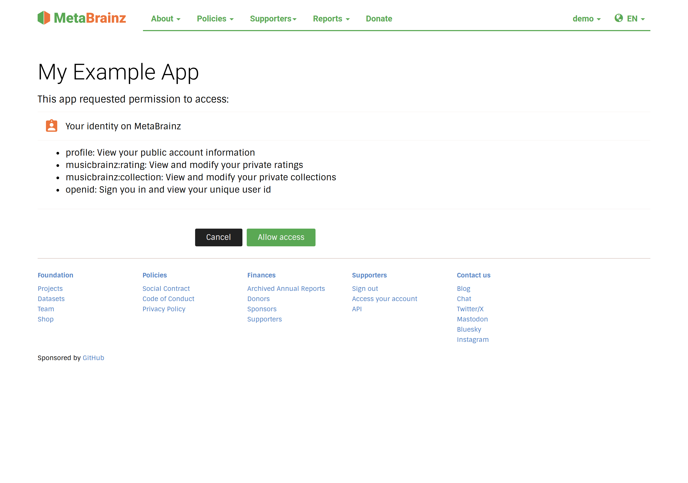

Authorization Code grant
========================

The Authorization Code grant (:rfc:`6749#section-4.1`) is the recommended flow
for almost all applications. The user is redirected to MetaBrainz to sign in
and approve your application, you receive a short-lived **authorization code**
on your redirect URI, and you exchange that code for tokens from your backend.

Every client is confidential and authenticates at the token endpoint with its
``client_secret``. Combine the flow with :ref:`PKCE
<oauth/authorization-code-grant:proof key for code exchange (pkce)>` as an
additional protection. Applications that cannot keep a secret (single-page,
mobile, native) must perform step 3 below from a backend that holds the secret.

Overview
--------

.. code-block:: text

   +--------+                                        +---------------+
   |        |--(1) authorization request ----------->|               |
   |        |         (browser redirect)             |    MetaBrainz |
   |        |                                        | authorization |
   | Client |<-(2) authorization code --------------|    server     |
   |  app   |         (redirect back)                |               |
   |        |                                        |               |
   |        |--(3) code + client auth (+ verifier)-->|               |
   |        |<-(4) access token (+ id/refresh token)-|               |
   +--------+                                        +---------------+

Step 1 — Authorization request
------------------------------

Redirect the user's browser to the authorization endpoint.

.. http:get:: /oauth2/authorize

   :query response_type: **Required.** Must be ``code``.
   :query client_id: **Required.** Your application's client identifier.
   :query redirect_uri: **Required.** Must exactly match a redirect URI
      registered for your client.
   :query scope: **Required.** Space-separated list of :doc:`scopes <scopes>`,
      e.g. ``openid profile musicbrainz:collection``.
   :query state: **Recommended.** An opaque value used to maintain state
      between the request and callback and to prevent CSRF. It is returned
      unchanged on the redirect; verify it matches what you sent.
   :query code_challenge: Optional but recommended. The PKCE code challenge.
      See :ref:`PKCE
      <oauth/authorization-code-grant:proof key for code exchange (pkce)>`.
   :query code_challenge_method: The PKCE method. Use ``S256``.
   :query nonce: **Required when requesting the** ``openid`` **scope.** A
      random string bound to the ID token to mitigate replay. See
      :doc:`openid-connect`.
   :query response_mode: Optional. When omitted, the code is returned in the
      ``query`` string. The only accepted explicit value is ``form_post``,
      which returns an auto-submitting HTML form that ``POST``\ s the response
      to your ``redirect_uri``; any other value is rejected with
      ``invalid_request``.
   :query approval_prompt: Optional. ``auto`` (default) or ``force``. With
      ``auto``, if the user has already granted the requested scopes to your
      client, consent is skipped and a code is returned immediately. With
      ``force`` the consent screen is always shown.

Example:

.. code-block:: text

   https://metabrainz.org/oauth2/authorize
     ?response_type=code
     &client_id=YOUR_CLIENT_ID
     &redirect_uri=https://example.com/callback
     &scope=openid%20profile%20musicbrainz:collection
     &state=af0ifjsldkj
     &code_challenge=E9Melhoa2OwvFrEMTJguCHaoeK1t8URWbuGJSstw-cM
     &code_challenge_method=S256

If the user is not signed in they are prompted to log in first. They then see a
consent screen listing your application's name and the human-readable
description of each requested scope, and can **Allow** or **Deny**.

   The consent screen shown at ``/oauth2/authorize``. It lists the application
   name and the description of each requested scope; **Allow access** returns an
   authorization code to your ``redirect_uri`` while **Cancel** returns
   ``error=access_denied``.

Step 2 — Redirect back with a code
----------------------------------

If the user approves, the browser is redirected to your ``redirect_uri`` with:

.. code-block:: text

   https://example.com/callback?code=AUTHORIZATION_CODE&state=af0ifjsldkj

Verify that ``state`` matches the value you sent. The authorization code is
single-use and expires after **10 minutes**.

If the user denies the request (or an error occurs), you receive an ``error``
parameter instead:

.. code-block:: text

   https://example.com/callback?error=access_denied

Step 3 & 4 — Exchange the code for tokens
-----------------------------------------

From your backend, exchange the code at the token endpoint.

.. http:post:: /oauth2/token

   :form grant_type: **Required.** Must be ``authorization_code``.
   :form code: **Required.** The authorization code from step 2.
   :form redirect_uri: **Required.** The same ``redirect_uri`` used in step 1.
   :form client_id: Your client identifier (if sending credentials as form
      fields rather than HTTP Basic auth).
   :form code_verifier: **Required if you used PKCE.** The original PKCE
      verifier.
   :reqheader Authorization: **Required.** Client authentication is mandatory.
      Send HTTP Basic credentials of ``client_id:client_secret``
      (``client_secret_basic``). Alternatively, send ``client_id`` and
      ``client_secret`` as form fields (``client_secret_post``).

Example request (confidential client using HTTP Basic auth):

.. code-block:: bash

   curl -X POST https://metabrainz.org/oauth2/token \
     -u "YOUR_CLIENT_ID:YOUR_CLIENT_SECRET" \
     -d grant_type=authorization_code \
     -d code=AUTHORIZATION_CODE \
     -d redirect_uri=https://example.com/callback \
     -d code_verifier=THE_ORIGINAL_PKCE_VERIFIER

Example response:

.. code-block:: json

   {
     "access_token": "b1c2d3...",
     "token_type": "Bearer",
     "expires_in": 3600,
     "refresh_token": "e4f5g6...",
     "scope": "openid profile musicbrainz:collection",
     "id_token": "eyJhbGciOiJFUzI1Ni ..."
   }

* ``access_token`` — use this as a Bearer token to call \*Brainz APIs.
* ``expires_in`` — lifetime of the access token in seconds (3600 = 1 hour).
* ``refresh_token`` — present when you can obtain new access tokens without
  user interaction. See :ref:`oauth/authorization-code-grant:refreshing access
  tokens`.
* ``id_token`` — present when the ``openid`` scope was granted. See
  :doc:`openid-connect`.

.. note::

   For a small number of trusted MetaBrainz clients the token response also
   includes a ``remember_me`` boolean reflecting the user's "remember me"
   session preference. You can ignore this field.

Using the access token
-----------------------

Send the access token in the ``Authorization`` header as a Bearer token when
calling a \*Brainz API or the :ref:`UserInfo endpoint
<oauth/token-endpoints:userinfo>`:

.. code-block:: text

   Authorization: Bearer b1c2d3...

Proof Key for Code Exchange (PKCE)
----------------------------------

PKCE (:rfc:`7636`) protects the authorization code against interception. It is
recommended for all clients as an additional safeguard. Note that PKCE
supplements client authentication here — it does not replace it, so the token
request must still include your client credentials.

#. Generate a high-entropy random ``code_verifier`` (43–128 characters).
#. Derive the ``code_challenge`` as the base64url-encoded SHA-256 of the
   verifier:

   .. code-block:: text

      code_challenge = BASE64URL( SHA256( code_verifier ) )

#. Send ``code_challenge`` and ``code_challenge_method=S256`` in the
   authorization request (step 1).
#. Send the original ``code_verifier`` in the token request (step 3).

If you sent a ``code_challenge`` in step 1, the server rejects the token
exchange when the verifier does not match the challenge. Use the ``S256``
method; the ``plain`` method is not recommended.

Refreshing access tokens
------------------------

When you receive a ``refresh_token`` you can obtain a new access token after the
old one expires, without sending the user through the browser flow again.

.. http:post:: /oauth2/token
   :noindex:

   :form grant_type: **Required.** Must be ``refresh_token``.
   :form refresh_token: **Required.** The refresh token you were issued.
   :form scope: Optional. A subset of the originally granted scopes.
   :reqheader Authorization: Client authentication, as in the code exchange
      above.

.. code-block:: bash

   curl -X POST https://metabrainz.org/oauth2/token \
     -u "YOUR_CLIENT_ID:YOUR_CLIENT_SECRET" \
     -d grant_type=refresh_token \
     -d refresh_token=e4f5g6...

The response has the same shape as the code exchange and includes a **new**
refresh token.

.. warning::

   **Refresh tokens rotate.** Each refresh returns a new refresh token and
   invalidates the one you just used — always store the newest value. As a
   security measure, if a refresh token that has already been used (revoked) is
   presented again, the server treats it as a possible token leak and revokes
   **all** access and refresh tokens issued to your client for that user. Handle
   this by restarting the authorization flow.

Errors
------

Errors from the authorization endpoint are returned to your ``redirect_uri`` as
an ``error`` query parameter (for example ``access_denied``,
``invalid_scope``, ``invalid_request``). Errors from the token endpoint are
returned as a JSON body with an ``error`` field and the appropriate HTTP status,
for example:

.. code-block:: json

   {
     "error": "invalid_grant",
     "error_description": "'code' in request is expired."
   }
