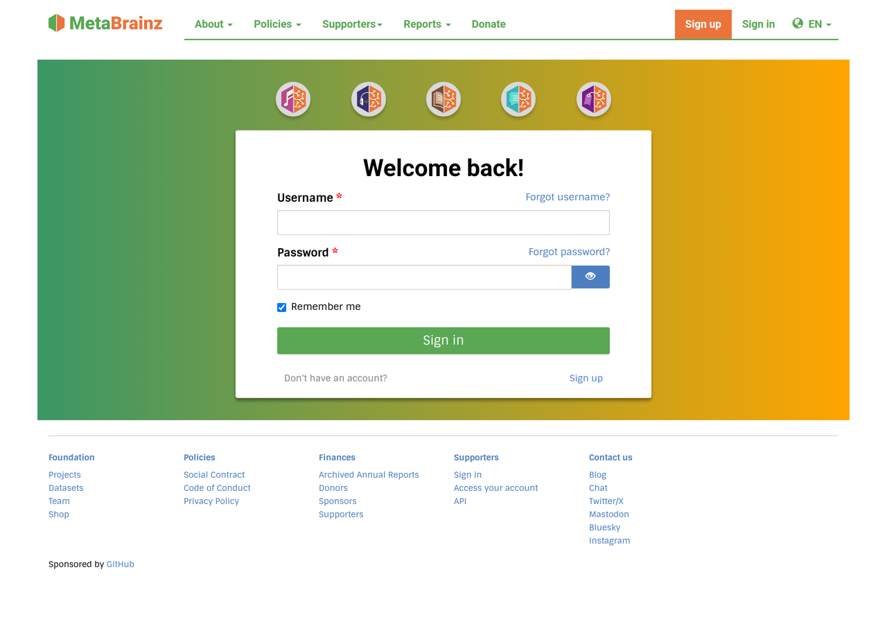
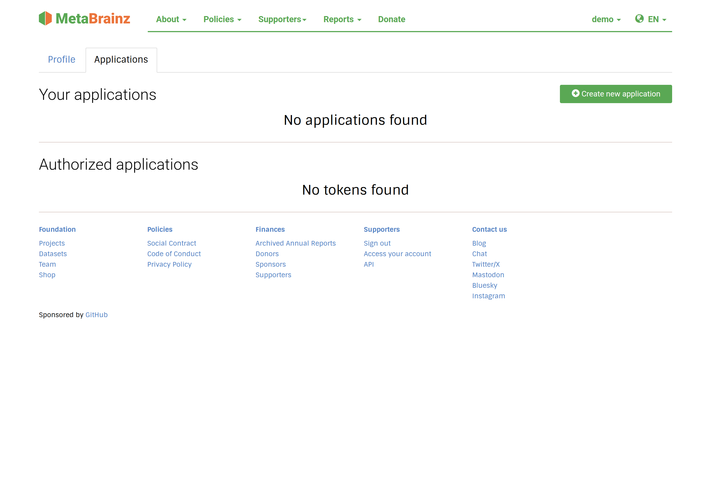
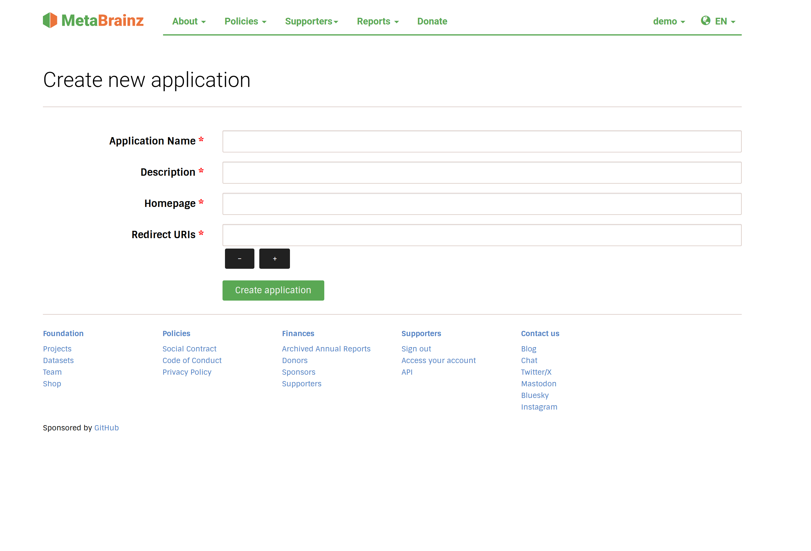
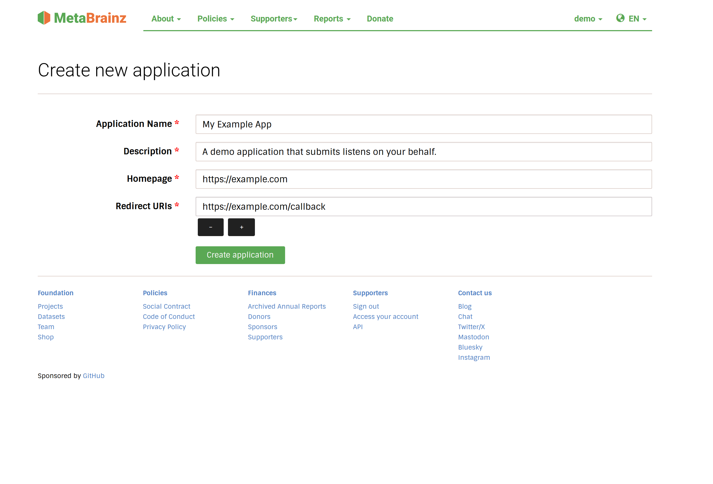
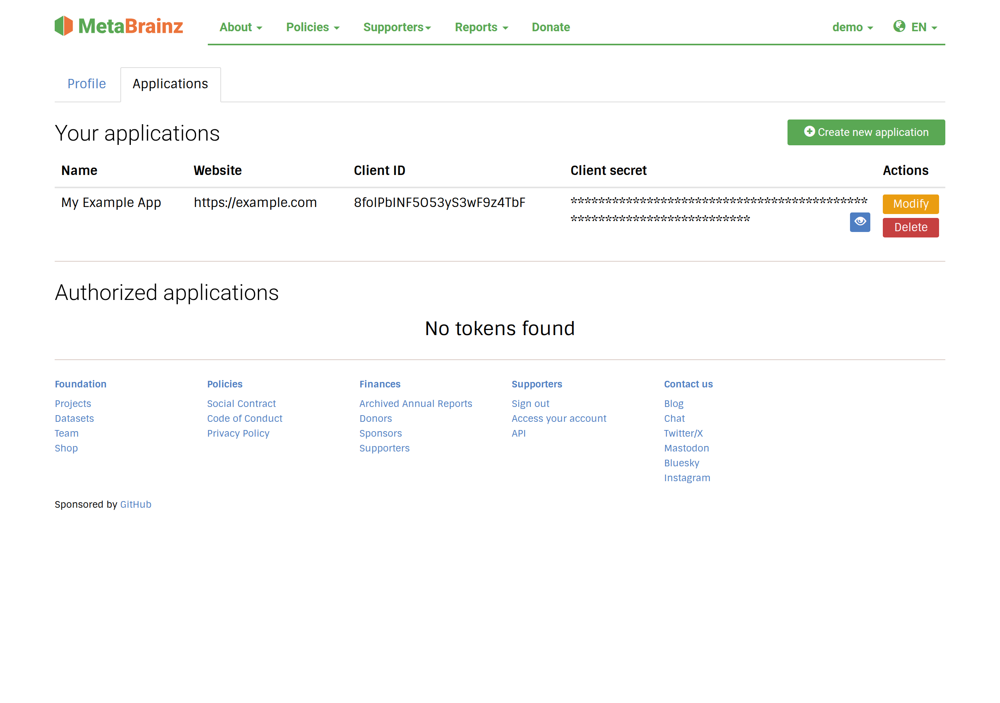
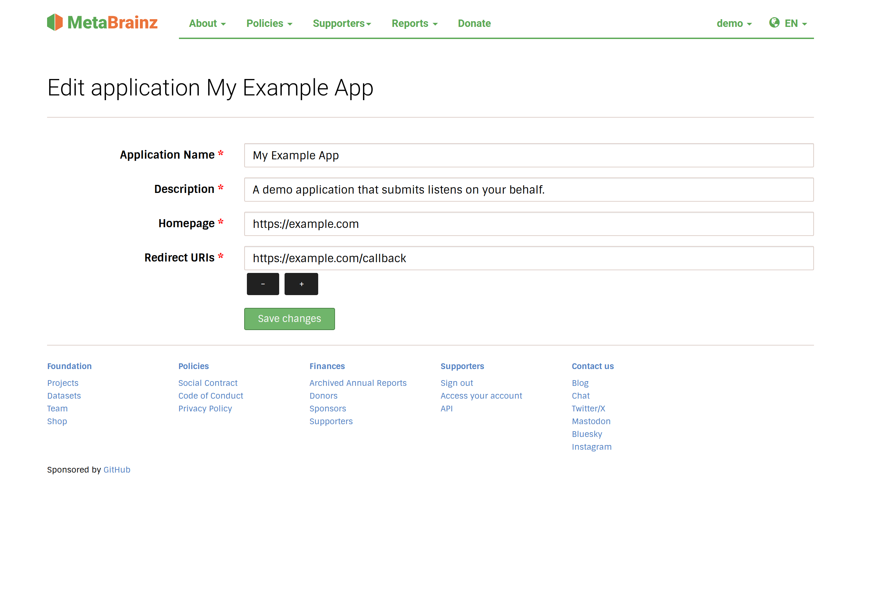

Registering an application
==========================

Before you can use any OAuth flow you must register an application with
MetaBrainz. Registration gives you a **client identifier** and, for
confidential clients, a **client secret**.

Applications are managed from your MetaBrainz account, under **Applications**:

    https://metabrainz.org/profile/applications

You need to be signed in to a MetaBrainz account. From this page you can create
new applications, edit or delete existing ones, and revoke access tokens that
you have granted to other applications.

   You must sign in to your MetaBrainz account before you can manage
   applications.

The **Applications** tab is empty until you register your first application:

   The Applications tab before any application has been registered.

Creating an application
-----------------------

Choose **Create a new application** and fill in the form:

   The blank create-application form.

``Application Name``
    A human-readable name for your application (3–64 characters). This is shown
    to users on the consent screen when they authorize your application, so
    choose something recognisable.

``Description``
    A short description of what the application does (3–512 characters). Also
    shown to users.

``Homepage``
    The home page of your application. Must be an ``http://`` or ``https://``
    URL.

``Authorization callback URL``
    One or more URLs the authorization server is allowed to redirect back to
    after the user approves or denies your request. You can add several. This is
    a critical security control:

    * The ``redirect_uri`` sent in an authorization request must **exactly
      match** one of the registered values (scheme, host, port and path).
    * URLs must use ``http`` or ``https``. Use ``https`` in production; plain
      ``http`` is intended only for ``localhost`` redirects during local
      development.
    * Register every environment you need (for example a production and a
      staging callback) as separate callback URLs.

   The create-application form, filled in with an example name, description,
   homepage and callback URL.

After you submit the form, MetaBrainz generates a ``client_id`` and
``client_secret`` for the application and shows them on the applications page.

   The **Applications** tab. Each application you own is listed with its
   ``client_id`` and (hidden by default) ``client_secret``, alongside
   **Modify** and **Delete** actions.

Editing and deleting
--------------------

   Editing an application lets you change its name, description, homepage and
   callback URLs.

From the applications page you can:

* **Edit** an application to change its name, description, homepage or callback
  URLs.
* **Delete** an application. This removes the client; existing tokens issued to
  it stop working.
* **Revoke** the access and refresh tokens that a given application currently
  holds for your account, without deleting the application.

All clients are confidential
----------------------------

Every registered application receives a ``client_secret``, and the token
endpoint **requires** the client to authenticate with it (via
``client_secret_basic`` or ``client_secret_post``; see
:doc:`authorization-code-grant`). There is currently **no support for public
clients** — that is, clients that authenticate without a secret.

This has an important consequence for applications that cannot keep a secret,
such as single-page applications, mobile apps and other native/desktop
software: the ``client_secret`` must never be embedded in code that runs on the
user's device, because it can be extracted. Instead, route the token exchange
(and any token refresh) through a backend component that holds the secret and
proxies requests for your front end. Using :ref:`PKCE
<oauth/authorization-code-grant:proof key for code exchange (pkce)>` is
recommended as an additional protection, but it does **not** replace client
authentication here.

Your credentials
----------------

After registering you will have:

``client_id``
    A public identifier for your application. It is sent in authorization and
    token requests and is not secret.

``client_secret``
    A confidential secret used to authenticate your application at the token
    endpoint. **Store it securely and never expose it in a browser, mobile app,
    or public repository.**

If a secret is ever leaked, delete and re-create the application to obtain new
credentials.

Trusted clients can also start a MetaBrainz account signup from their own
application. See :doc:`registration-requests`.

Next steps
----------

Once registered, continue with the :doc:`Authorization Code grant
<authorization-code-grant>`, or see :doc:`scopes` to decide what access to
request.
